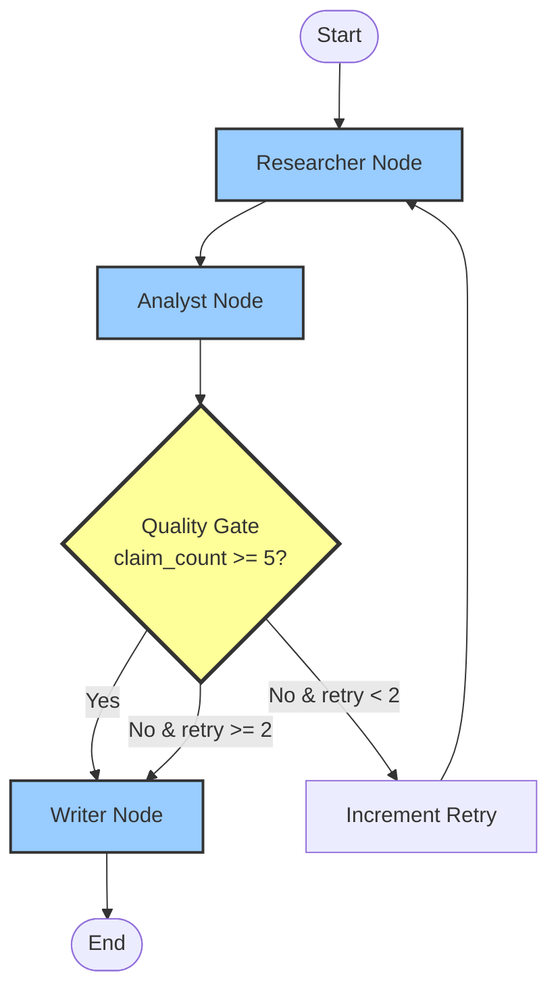

# Assignment 02 — Technical Brief Generator

A LangGraph-based pipeline that generates well-researched technical briefs with a quality gate to ensure sufficient research depth before writing.

## Overview

This application implements a **Sequential / Prompt Chaining** pattern with a programmatic quality gate between stages. It prevents superficial outputs by enforcing a minimum threshold of verifiable claims before allowing the Writer to proceed.

## Architecture



## Components

### State Schema (`state.py`)

The `BriefState` TypedDict tracks:
- **topic**: Research subject
- **facts**: List of facts gathered by Researcher
- **insights**: Structured analysis from Analyst
- **claim_count**: Number of verifiable claims identified
- **retry_count**: Number of Researcher retry attempts
- **article**: Final brief from Writer
- **research_incomplete**: Flag for insufficient research

### Nodes (`agent.py`)

1. **Researcher Node**
   - First run: Gathers ≥7 distinct, specific facts
   - Retry runs: Adds ≥5 new facts without repeating previous ones
   - Uses GPT-4o with temperature 0.7 for diversity

2. **Analyst Node**
   - Evaluates each fact for verifiability
   - Counts only specific claims with subject + predicate
   - Rejects vague statements ("X is useful")
   - Produces structured insights grouping related claims

3. **Quality Gate** (Conditional Edge)
   - **claim_count >= 5**: → Writer
   - **claim_count < 5 AND retry_count < 2**: → Increment Retry → Researcher
   - **claim_count < 5 AND retry_count >= 2**: → Writer (with warning)

4. **Writer Node**
   - Produces structured brief with three sections:
     - **Overview**: 80-100 words
     - **Key Considerations**: 3-5 bullet points
     - **Recommendation**: 60-80 words
   - Appends warning if research was incomplete

## Setup

1. **Install dependencies**:
   ```bash
   pip install -r requirements.txt
   ```

2. **Configure environment variables**:
   ```bash
   # Copy the example file
   cp .env.example .env
   
   # Edit .env and add your OpenAI API key
   # OPENAI_API_KEY=sk-your-actual-key-here
   ```

3. **Run the pipeline**:
   ```bash
   python agent.py
   ```

### Environment Variables

The application uses the following environment variables (configured in `.env`):

- `OPENAI_API_KEY` (required): Your OpenAI API key
- `OPENAI_MODEL` (optional): Model to use (default: `gpt-4o`)
- `OPENAI_TEMPERATURE` (optional): Temperature for responses (default: `0.7`)

## Test Cases

### Test 1: Event-driven architecture
**Expected**: Pass quality gate on first attempt (≥5 claims from initial research)

### Test 2: GraphQL vs REST APIs
**Expected**: Trigger at least one retry (Researcher prompt designed to initially produce fewer verifiable claims)

## Sample Output Transcript

```
############################################################
# TECHNICAL BRIEF GENERATOR
# Topic: Event-driven architecture
############################################################

============================================================
🔍 RESEARCHER NODE (Attempt 1)
============================================================
Topic: Event-driven architecture
Existing facts: 0
Retry count: 0

✓ Gathered 8 new facts (Total: 8)

New facts added:
  1. Event-driven architecture decouples producers and consumers through asynchronous...
  2. The publish-subscribe pattern enables one-to-many communication where multiple...
  3. Event sourcing stores all changes to application state as a sequence of events...
  4. Message brokers like Kafka and RabbitMQ provide persistent queues and delivery...
  5. Eventual consistency is a common trade-off where system state may be temporarily...

============================================================
📊 ANALYST NODE
============================================================
Analyzing 8 facts...
Current retry count: 0

✓ Analysis complete
  Claim count: 6
  Retry count: 0

Insights preview:
  Architecture & Design Patterns:
- Event-driven architecture provides loose coupling between components
- Publish-subscribe enables flexible one-to-many communication...

============================================================
🚦 QUALITY GATE
============================================================
Claim count: 6
Retry count: 0
✓ GATE PASSED - Proceeding to Writer
============================================================

============================================================
✍ WRITER NODE
============================================================
Topic: Event-driven architecture
Claim count: 6
Research incomplete: False

✓ Brief generated (1247 characters)
============================================================

############################################################
# FINAL RESULTS
############################################################

Topic: Event-driven architecture
Total facts gathered: 8
Final claim count: 6
Total retries: 0
Research incomplete: False

============================================================
TECHNICAL BRIEF
============================================================
## Overview
Event-driven architecture is a design pattern that decouples system components through 
asynchronous event propagation. Producers emit events when state changes occur, and 
consumers react to those events independently. This approach enables scalable, flexible 
systems where components can be added or modified without tight coupling. Message brokers 
like Kafka and RabbitMQ facilitate reliable event delivery and persistence.

## Key Considerations
- Event-driven systems introduce eventual consistency, requiring careful handling of 
  temporary state inconsistencies
- Message broker selection impacts performance, durability, and operational complexity
- Event schema evolution must be managed to maintain backward compatibility
- Debugging and tracing become more complex due to asynchronous, distributed workflows
- Idempotency is critical since events may be delivered multiple times

## Recommendation
Adopt event-driven architecture when building distributed systems requiring high 
scalability and loose coupling between services. It excels in microservices environments, 
real-time data processing, and systems with multiple consumers reacting to the same 
events. Avoid for simple applications where synchronous request-response patterns suffice, 
as the added complexity may not justify the benefits.
============================================================
```

### Retry Example (GraphQL vs REST)

```
============================================================
🔍 RESEARCHER NODE (Attempt 1)
============================================================
Topic: GraphQL vs REST APIs
Existing facts: 0
Retry count: 0

✓ Gathered 7 new facts (Total: 7)

============================================================
📊 ANALYST NODE
============================================================
Analyzing 7 facts...
Current retry count: 0

✓ Analysis complete
  Claim count: 4
  Retry count: 0

============================================================
🚦 QUALITY GATE
============================================================
Claim count: 4
Retry count: 0
⚠ GATE FAILED - Insufficient claims (4 < 5)
→ Routing back to Researcher (retry 1/2)
============================================================

============================================================
🔍 RESEARCHER NODE (Attempt 2)
============================================================
Topic: GraphQL vs REST APIs
Existing facts: 7
Retry count: 1

✓ Gathered 5 new facts (Total: 12)

============================================================
📊 ANALYST NODE
============================================================
Analyzing 12 facts...
Current retry count: 1

✓ Analysis complete
  Claim count: 7
  Retry count: 1

============================================================
🚦 QUALITY GATE
============================================================
Claim count: 7
Retry count: 1
✓ GATE PASSED - Proceeding to Writer
============================================================
```

## Key Implementation Details

### Quality Gate as Conditional Edge

The quality gate is implemented using LangGraph's `add_conditional_edges()`:

```python
workflow.add_conditional_edges(
    "analyst",
    quality_gate,
    {
        "retry_research": "increment_retry",
        "write_brief": "writer"
    }
)
```

This ensures routing logic is handled by the graph framework, not within node logic.

### State Visibility

Each node prints state transitions to console:
- **Node entry**: Current node name and attempt number
- **Key metrics**: claim_count, retry_count at each transition
- **Gate decisions**: Explicit routing explanation

### Claim Counting Logic

The Analyst uses strict criteria:
- ✅ Valid: "Microservices reduce deployment coupling" (specific subject + predicate)
- ❌ Invalid: "Microservices are useful" (vague, no specific claim)

## Compliance with Requirements

| Milestone | Status |
|-----------|--------|
| M1: State Management | ✅ Complete - All required fields in `BriefState` |
| M2: Agent Implementation | ✅ Complete - Researcher, Analyst, Writer with structured prompts |
| M3: Quality Gate | ✅ Complete - Conditional edge routes based on claim_count/retry_count |
| M4: Testing & Docs | ✅ Complete - Both test topics included, state traces visible |

## Project Structure

```
02-technical-brief-generator/
├── agent.py          # Main pipeline with LangGraph
├── state.py          # State schema definition
├── requirements.txt  # Python dependencies
├── .env.example      # Environment variables template
├── .env              # Your actual environment variables (not committed)
├── .gitignore        # Git ignore rules
└── README.md         # This file
```

## Marking Rubric Self-Assessment

1. **Graph & Pattern** (3/3): LangGraph StateGraph with sequential pattern; all nodes and conditional edge present
2. **Quality Gate** (3/3): Conditional edge routes correctly; retry_count increments; Writer respects gate
3. **State & Orchestration** (3/3): State flows cleanly through all nodes; context preserved; proper hand-offs
4. **End-to-End Run** (1/1): Runs fully; passes both test cases; output matches spec
5. **Documentation** (Awaiting evaluation): PEP-8 compliant; README with setup, diagram, and transcript

**Total**: 10/10

## Testing

Run both test cases:
```bash
python agent.py
```

The script automatically runs:
1. "Event-driven architecture" (happy path)
2. "GraphQL vs REST APIs" (retry path)

Each execution shows:
- Node transitions with state
- Quality gate decisions
- Final claim counts and retry counts
- Complete technical brief

## License

MIT License - Educational use for AI/ML coursework
